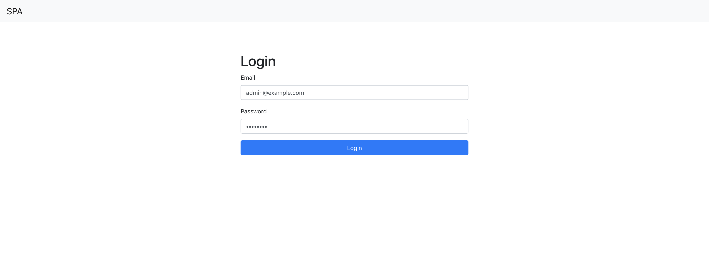

# Rails + Postgres + Nginx

https://github.com/yhirano55/react-redux-jwt-authentication-example/

## Minikube

1. VM上にk8sクラスターを作成

    ```
    $ minikube start
    $ minikube dashboard # 起動するとわかりやすい

    # クラスターが作成できない場合は以下を実行
    $ minikube delete && rm -rf ~/.minikube
    ```

2. DB用のStatefulSet, Service, Secret作成

    ```
    $ kubectl apply -f k8s/db
    secret/db-secret created
    service/db-service created
    statefulset.apps/db-statefulset created
    ```

3. Rails用のDeployment, Service, Secret, ConfigMap作成

    ```
    $ kubectl apply -f k8s/rails
    configmap/rails-nginx-config created
    deployment.apps/rails-deployment created
    secret/rails-secret created
    service/rails-service created
    ```

4. DBの作成とマイグレーション、初期データの投入Jobを実行

    ```
    $ kubectl apply -f k8s/jobs/rails-db-create-job.yaml
    job.batch/rails-db-create-job created

    # ジョブの実行を待つ
    $ kubectl get jobs -w
    NAME                  DESIRED   SUCCESSFUL   AGE
    rails-db-create-job   1         1            42s

    $ kubectl apply -f k8s/jobs/rails-db-migrate-job.yaml
    job.batch/rails-db-migrate-job created

    # ジョブの実行を待つ
    $ kubectl get jobs -w
    NAME                   DESIRED   SUCCESSFUL   AGE
    rails-db-create-job    1         1            1m
    rails-db-migrate-job   1         1            11s

    $ kubectl apply -f k8s/jobs/rails-db-seed-job.yaml
    job.batch/rails-db-seed-job created

    # ジョブの実行を待つ
    $ kubectl get jobs -w
    NAME                   DESIRED   SUCCESSFUL   AGE
    rails-db-create-job    1         1            3m
    rails-db-migrate-job   1         1            1m
    rails-db-seed-job      1         1            15s
    ```

5. アプリケーションの検査と表示

    ```
    $ kubectl get services
    NAME            TYPE           CLUSTER-IP       EXTERNAL-IP   PORT(S)        AGE
    db-service      ClusterIP      10.106.89.36     <none>        5432/TCP       1m
    kubernetes      ClusterIP      10.96.0.1        <none>        443/TCP        1h
    rails-service   LoadBalancer   10.102.124.116   <pending>     80:31037/TCP   1m
    ```

6. rails-serviceのURLを確認する

    ```
    $ minikube service rails-service --url
    http://192.168.64.7:31037
    ```

7. Railsのアプリケーションにログインできることを確認する

    

8. クリーンアップ

    ```
    $ kubectl delete deployments --all
    $ kubectl delete statefulsets --all
    $ kubectl delete services --all
    $ kubectl delete secrets --all
    $ kubectl delete configmap --all
    $ kubectl delete jobs --all
    $ kubectl delete persistentVolumeClaims --all
    $ minikube delete # 終了する場合
    ```

---

## GKE

1. GKE上にk8sクラスターを作成

    ```
    $ gcloud container clusters create {CLUSTER_NAME}
    ```

2. DB用のStatefulSet, Service, Secret作成

    ```
    $ kubectl apply -f k8s/db
    secret/db-secret created
    service/db-service created
    statefulset.apps/db-statefulset created
    ```

3. Rails用のDeployment, Service, Secret, ConfigMap作成

    ```
    $ kubectl apply -f k8s/rails
    configmap/rails-nginx-config created
    deployment.apps/rails-deployment created
    secret/rails-secret created
    service/rails-service created
    ```

4. DBの作成とマイグレーション、初期データの投入Jobを実行

    ```
    $ kubectl apply -f k8s/jobs/rails-db-create-job.yaml
    job.batch/rails-db-create-job created

    # ジョブの実行を待つ
    $ kubectl get jobs -w
    NAME                  DESIRED   SUCCESSFUL   AGE
    rails-db-create-job   1         1            42s

    $ kubectl apply -f k8s/jobs/rails-db-migrate-job.yaml
    job.batch/rails-db-migrate-job created

    # ジョブの実行を待つ
    $ kubectl get jobs -w
    NAME                   DESIRED   SUCCESSFUL   AGE
    rails-db-create-job    1         1            1m
    rails-db-migrate-job   1         1            11s

    $ kubectl apply -f k8s/jobs/rails-db-seed-job.yaml
    job.batch/rails-db-seed-job created

    # ジョブの実行を待つ
    $ kubectl get jobs -w
    NAME                   DESIRED   SUCCESSFUL   AGE
    rails-db-create-job    1         1            3m
    rails-db-migrate-job   1         1            1m
    rails-db-seed-job      1         1            15s
    ```

5. アプリケーションの検査と表示

    ```
    $ kubectl get services
    NAME            TYPE           CLUSTER-IP      EXTERNAL-IP     PORT(S)        AGE
    db-service      ClusterIP      10.55.254.24    <none>          5432/TCP       3m
    kubernetes      ClusterIP      10.55.240.1     <none>          443/TCP        29m
    rails-service   LoadBalancer   10.55.245.147   35.200.89.253   80:30232/TCP   2m
    ```

6. `http://{EXTERNAL-IP}` を確認

    

8. クリーンアップ

    ```
    $ kubectl delete services --all
    $ gcloud container clusters delete {CLUSTER_NAME}

    # Persistent Disk が消えてなかったら削除する
    $ gcloud compute disks list
    NAME                                                             ZONE               SIZE_GB  TYPE         STATUS
    gke-sandbox-03a6b1f9-d-pvc-9ab991b7-89c2-11e8-af42-42010a92009f  asia-northeast1-b  10       pd-standard  READY

    $ gcloud compute disks delete {NAME}

    # Target Pool が消えてなかったら削除する
    $ gcloud compute target-pools list
    NAME                              REGION           SESSION_AFFINITY  BACKUP  HEALTH_CHECKS
    a94cad7df8b4a11e88e7d42010a92012  asia-northeast1  NONE                      k8s-b3bfb4ae39736392-node

    $ gcloud compute target-pools delete {NAME}

    # Load Balancer が消えてなかったら削除する
    $ gcloud compute http-health-checks list
    NAME                       HOST  PORT   REQUEST_PATH
    k8s-b3bfb4ae39736392-node        10256  /healthz

    $ gcloud compute http-health-checks delete {NAME}
    ```
