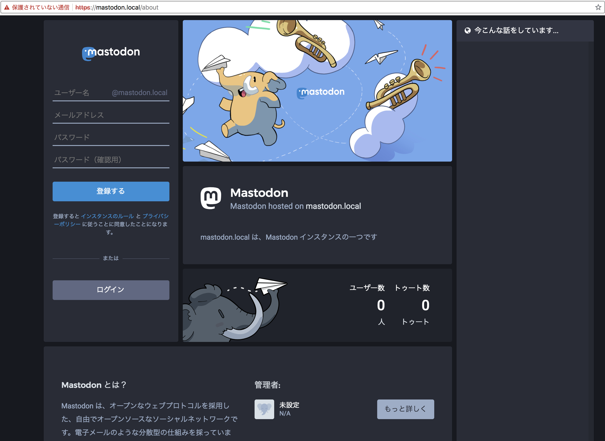
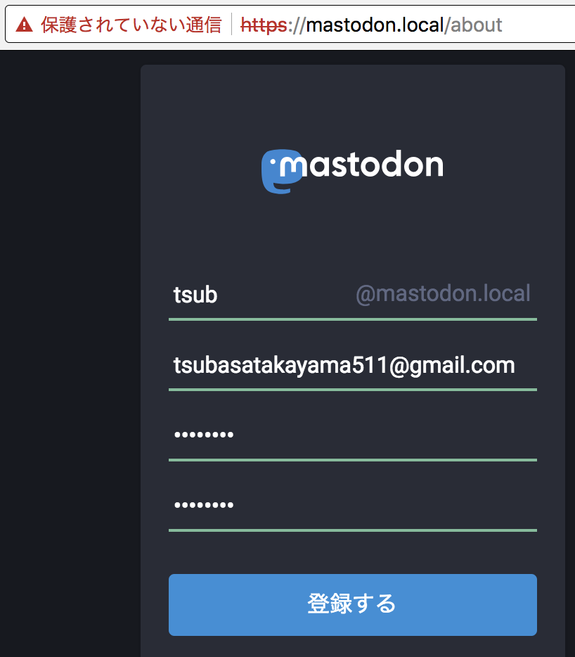
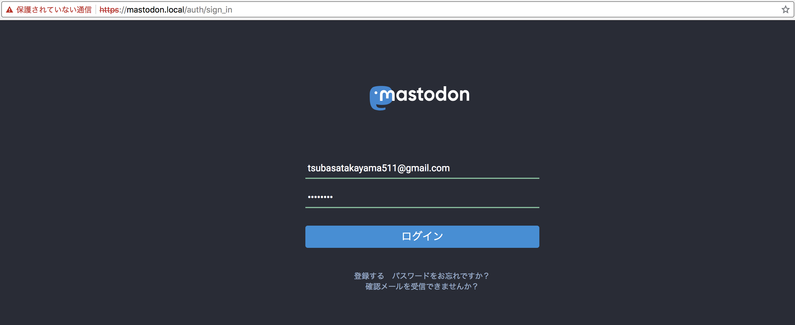
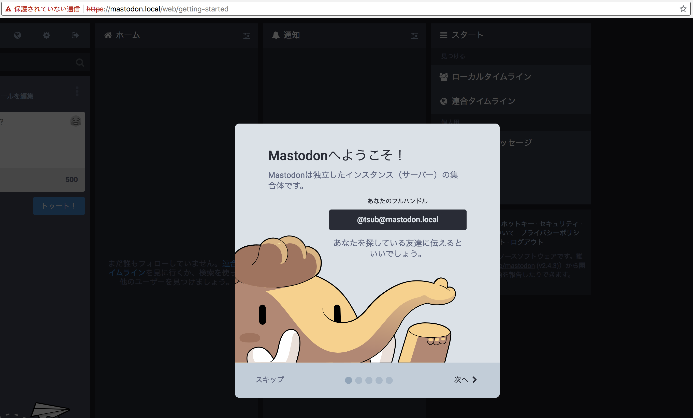

# Mastodon

* ~~httpsでの接続が必須な関係で手順はminikubeのみとなります~~ ドメインを持っている人限定ですが、GKEも対応しました
* 簡単のため、シングルユーザーモードでの起動となります
* SMTPサーバーの用意ができなかったため、メール確認は無理やり通します
* 今回WebSocket対応は出来てません
* 最新バージョン (v2.4.3) のMastodonではいくつかバグがあったため、Dockerイメージは `tootsuite/mastodon:edge` を使っています

## Minikube

1. VM上にk8sクラスターを作成

    ```
    $ minikube start --memory 8192 # デフォルトの2048でメモリが足りないため
    $ minikube dashboard # 起動するとわかりやすい

    # クラスターが作成できない場合は以下を実行
    $ minikube delete && rm -rf ~/.minikube
    ```

2. DB用のStatefulSet, Service, Secret作成

    ```
    $ kubectl apply -f k8s/db
    secret/db-secret created
    service/db-service created
    statefulset.apps/db-statefulset created
    ```

3. Redis用のStatefulSet, Service作成

    ```
    $ kubectl apply -f k8s/redis
    service/redis-service created
    statefulset.apps/redis-statefulset created
    ```

4. Mastodon用のSecretのみ作成

    ```
    $ kubectl apply -f k8s/mastodon/secret.yaml
    secret/mastodon-secret created
    ```

5. DBのマイグレーションを実行

    ```
    $ kubectl apply -f k8s/jobs/db-create-job.yaml
    job.batch/db-create-job created

    # ジョブの実行を待つ
    $ kubectl get jobs -w
    NAME            DESIRED   SUCCESSFUL   AGE
    db-create-job   1         1            3m

    $ kubectl apply -f k8s/jobs/db-migrate-job.yaml
    job.batch/db-migrate-jobb created

    # ジョブの実行を待つ
    $ kubectl get jobs -w
    NAME              DESIRED   SUCCESSFUL   AGE
    db-create-job     1         1            5m
    db-migrate-jobb   1         1            1m
    ```

6. MinikubeのIPアドレスでmastodon.localにアクセスできるように`/etc/hosts`に書き込む (httpsでアクセスするため)

    ```
    $ minikube ip
    192.168.64.17

    $ sudo vi /etc/hosts
    $ sudo tail -n1 /etc/hosts
    192.168.64.17   mastodon.local
    ```

7. ServiceのexternalIPsにMinikubeのIPアドレスを指定する (httpsでアクセスするため)

    ```
    $ vi k8s/mastodon/service.yaml
    $ tail -n2 k8s/mastodon/service.yaml
    externalIPs:
    - 192.168.64.17
    ```

8. Mastodon用のDeployment, Service作成

    ```
    $ kubectl apply -f k8s/mastodon
    deployment.apps/mastodon-web-deployment created
    deployment.apps/mastodon-worker-deployment created
    secret/mastodon-secret unchanged
    service/mastodon-service created
    ```

7. アプリケーションの検査と表示

    ```
    $ kubectl get services
    NAME               TYPE           CLUSTER-IP      EXTERNAL-IP     PORT(S)                      AGE
    db-service         ClusterIP      10.96.20.178    <none>          5432/TCP                     11m
    kubernetes         ClusterIP      10.96.0.1       <none>          443/TCP                      12m
    mastodon-service   LoadBalancer   10.100.43.202   192.168.64.17   80:31878/TCP,443:32696/TCP   5m
    redis-service      ClusterIP      10.98.107.176   <none>          6379/TCP                     11m
    ```

8. `https://mastodon.local` を確認
    * アクセス出来るようになるまで時間がかかります
    * 自己署名証明書を使っているため、ブラウザで警告画面が出ますがそのまま開いてください

    

9. 画面左上から自分のログイン情報を入力してサインアップ
    * メールアドレスは実在するものでないといけません
    * パスワードは任意のものを入力

    

10. JobのYaml内にそれぞれ先ほど入力したユーザー情報を指定
    * SMTPサーバーの用意ができなかったため、メール確認はRakeタスクで通します

    ```
    $ vi k8s/jobs/confirm-email-job.yaml
    $ tail -n2 jobs/confirm-email-job.yaml
        - name: USER_EMAIL
          value: tsubasatakayama511@gmail.com

    $ vi k8s/jobs/make-admin-job.yaml
    $ tail -n2 jobs/make-admin-job.yaml
        - name: USERNAME
          value: tsub
    ```

11. メール確認と管理者権限付与のJobを実行

    ```
    $ kubectl apply -f k8s/jobs/confirm-email-job.yaml
    job.batch/confirm-email-job created

    # ジョブの実行を待つ
    $ kubectl get jobs -w
    NAME                DESIRED   SUCCESSFUL   AGE
    confirm-email-job   1         1            22s
    db-create-job       1         1            30m
    db-migrate-jobb     1         1            26m

    $ kubectl apply -f k8s/jobs/make-admin-job.yaml
    job.batch/make-admin-job created

    # ジョブの実行を待つ
    $ kubectl get jobs -w
    NAME                DESIRED   SUCCESSFUL   AGE
    confirm-email-job   1         1            56s
    db-create-job       1         1            30m
    db-migrate-jobb     1         1            26m
    make-admin-job      1         1            15s
    ```

12. `https://mastodon.local/auth/sign_in` を確認
13. 先ほど入力したユーザー情報を入力してサインイン

    

14. サインインできることを確認

    

15. クリーンアップ

    ```
    $ kubectl delete deployments --all
    $ kubectl delete statefulsets --all
    $ kubectl delete services --all
    $ kubectl delete secrets --all
    $ kubectl delete jobs --all
    $ kubectl delete persistentVolumeClaims --all
    $ minikube delete # 終了する場合
    ```

---

## GKE

1. GKE上にk8sクラスターを作成

    ```
    $ gcloud container clusters create {CLUSTER_NAME}
    ```

2. DB用のStatefulSet, Service, Secret作成

    ```
    $ kubectl apply -f k8s/db
    secret/db-secret created
    service/db-service created
    statefulset.apps/db-statefulset created
    ```

3. Redis用のStatefulSet, Service作成

    ```
    $ kubectl apply -f k8s/redis
    service/redis-service created
    statefulset.apps/redis-statefulset created
    ```

4. Mastodon用のSecretのみ作成

    ```
    $ kubectl apply -f k8s/mastodon/secret.yaml
    secret/mastodon-secret created
    ```

5. DBのマイグレーションを実行

    ```
    $ kubectl apply -f k8s/jobs/db-create-job.yaml
    job.batch/db-create-job created

    # ジョブの実行を待つ
    $ kubectl get jobs -w
    NAME            DESIRED   SUCCESSFUL   AGE
    db-create-job   1         1            3m

    $ kubectl apply -f k8s/jobs/db-migrate-job.yaml
    job.batch/db-migrate-jobb created

    # ジョブの実行を待つ
    $ kubectl get jobs -w
    NAME              DESIRED   SUCCESSFUL   AGE
    db-create-job     1         1            5m
    db-migrate-jobb   1         1            1m
    ```

6. Minikube用の設定 (`k8s/mastodon/service.yaml` の末尾2行) を削除する

    ```
    $ tail -n2 k8s/mastodon/service.yaml
    externalIPs:
    - {USER MINIKUBE IP}
    $ vi k8s/mastodon/service.yaml
    $ tail -n2 k8s/mastodon/service.yaml
      targetPort: 443
    type: LoadBalancer
    ```

7. `k8s/mastodon/deployment.yaml` を編集して利用したいドメインなどを記述する

    ```diff
    diff --git a/09_mastodon/k8s/mastodon/deployment.yaml b/09_mastodon/k8s/mastodon/deployment.yaml
    index 0601359..3f1186a 100644
    --- a/09_mastodon/k8s/mastodon/deployment.yaml
    +++ b/09_mastodon/k8s/mastodon/deployment.yaml
    @@ -39,7 +39,7 @@ spec:
                   name: db-secret
                   key: POSTGRES_PASSWORD
             - name: LOCAL_DOMAIN
    -          value: mastodon.local
    +          value: mastodon.tsub.me
             - name: SECRET_KEY_BASE
               valueFrom:
                 secretKeyRef:
    @@ -69,9 +69,9 @@ spec:
             - containerPort: 443
             env:
             - name: DOMAINS
    -          value: "mastodon.local -> http://127.0.0.1:3000"
    +          value: "mastodon.tsub.me -> http://127.0.0.1:3000"
             - name: STAGE
    -          value: local
    +          value: production
     
     ---
    ```

8. Mastodon用のDeployment, Service作成

    ```
    $ kubectl apply -f k8s/mastodon
    deployment.apps/mastodon-web-deployment created
    deployment.apps/mastodon-worker-deployment created
    secret/mastodon-secret unchanged
    service/mastodon-service created
    ```

9. アプリケーションの検査と表示

    ```
    $ kubectl get services
    NAME               TYPE           CLUSTER-IP      EXTERNAL-IP      PORT(S)                      AGE
    db-service         ClusterIP      10.55.240.177   <none>           5432/TCP                     14m
    kubernetes         ClusterIP      10.55.240.1     <none>           443/TCP                      15m
    mastodon-service   LoadBalancer   10.55.244.241   35.189.141.150   80:32009/TCP,443:31664/TCP   1m
    redis-service      ClusterIP      10.55.250.1     <none>           6379/TCP                     14m
    ```

9. `EXTERNAL-IP` を DNS の A レコードとして登録する

    ```
    $ dig mastodon.tsub.me

    ; <<>> DiG 9.10.6 <<>> mastodon.tsub.me
    ;; global options: +cmd
    ;; Got answer:
    ;; ->>HEADER<<- opcode: QUERY, status: NOERROR, id: 262
    ;; flags: qr rd ra; QUERY: 1, ANSWER: 1, AUTHORITY: 0, ADDITIONAL: 1

    ;; OPT PSEUDOSECTION:
    ; EDNS: version: 0, flags:; udp: 1452
    ;; QUESTION SECTION:
    ;mastodon.tsub.me.              IN      A

    ;; ANSWER SECTION:
    mastodon.tsub.me.       167     IN      A       35.189.141.150

    ;; Query time: 40 msec
    ;; SERVER: 1.1.1.1#53(1.1.1.1)
    ;; WHEN: Sat Jul 21 15:45:39 JST 2018
    ;; MSG SIZE  rcvd: 61
    ```

10. `https://{ドメイン名}` を確認
    * アクセス出来るようになるまで時間がかかります

    

11. 画面左上から自分のログイン情報を入力してサインアップ
    * メールアドレスは実在するものでないといけません
    * パスワードは任意のものを入力

    

12. JobのYaml内にそれぞれ先ほど入力したユーザー情報を指定
    * SMTPサーバーの用意ができなかったため、メール確認はRakeタスクで通します

    ```
    $ vi k8s/jobs/confirm-email-job.yaml
    $ tail -n2 jobs/confirm-email-job.yaml
        - name: USER_EMAIL
          value: tsubasatakayama511@gmail.com

    $ vi k8s/jobs/make-admin-job.yaml
    $ tail -n2 jobs/make-admin-job.yaml
        - name: USERNAME
          value: tsub
    ```

13. メール確認と管理者権限付与のJobを実行

    ```
    $ kubectl apply -f k8s/jobs/confirm-email-job.yaml
    job.batch/confirm-email-job created

    # ジョブの実行を待つ
    $ kubectl get jobs -w
    NAME                DESIRED   SUCCESSFUL   AGE
    confirm-email-job   1         1            22s
    db-create-job       1         1            30m
    db-migrate-jobb     1         1            26m

    $ kubectl apply -f k8s/jobs/make-admin-job.yaml
    job.batch/make-admin-job created

    # ジョブの実行を待つ
    $ kubectl get jobs -w
    NAME                DESIRED   SUCCESSFUL   AGE
    confirm-email-job   1         1            56s
    db-create-job       1         1            30m
    db-migrate-jobb     1         1            26m
    make-admin-job      1         1            15s
    ```

14. `https://{ドメイン名}/auth/sign_in` を確認
15. 先ほど入力したユーザー情報を入力してサインイン

    

14. サインインできることを確認

    

15. クリーンアップ

    ```
    $ kubectl delete services --all
    $ gcloud container clusters delete {CLUSTER_NAME}

    # Persistent Disk が消えてなかったら削除する
    $ gcloud compute disks list
    NAME                                                             ZONE               SIZE_GB  TYPE         STATUS
    gke-sandbox-03a6b1f9-d-pvc-9ab991b7-89c2-11e8-af42-42010a92009f  asia-northeast1-b  10       pd-standard  READY

    $ gcloud compute disks delete {NAME}

    # Target Pool が消えてなかったら削除する
    $ gcloud compute target-pools list
    NAME                              REGION           SESSION_AFFINITY  BACKUP  HEALTH_CHECKS
    a94cad7df8b4a11e88e7d42010a92012  asia-northeast1  NONE                      k8s-b3bfb4ae39736392-node

    $ gcloud compute target-pools delete {NAME}

    # Load Balancer が消えてなかったら削除する
    $ gcloud compute http-health-checks list
    NAME                       HOST  PORT   REQUEST_PATH
    k8s-b3bfb4ae39736392-node        10256  /healthz

    $ gcloud compute http-health-checks delete {NAME}
    ```
