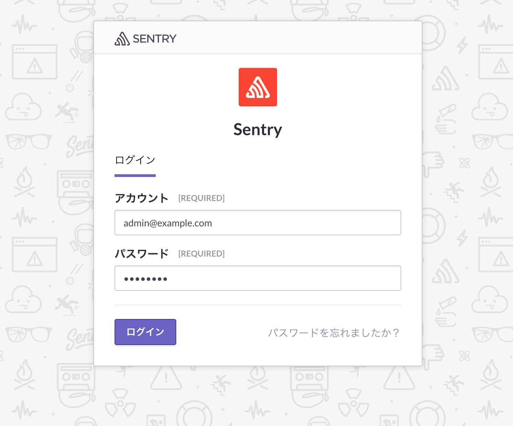

# Sentry

## GKE

1. GKE上にk8sクラスターを作成

    ```
    $ gcloud container clusters create {CLUSTER_NAME}
    ```

2. DB用のStatefulSet, Service, Secret作成

    ```
    $ kubectl apply -f k8s/db
    secret/db-secret created
    service/db-service created
    statefulset.apps/db-statefulset created
    ```

3. Redis用のStatefulSet, Service作成

    ```
    $ kubectl apply -f k8s/redis
    service/redis-service created
    statefulset.apps/redis-statefulset created
    ```

4. Sentry用のSecretのみ作成

    ```
    $ kubectl apply -f k8s/sentry/secret.yaml
    secret/sentry-secret created
    ```

5. DBのマイグレーションとsuperuserの作成Jobを実行

    ```
    $ kubectl apply -f k8s/jobs/sentry-upgrade-job.yaml
    job.batch/sentry-upgrade-job created

    # ジョブの実行を待つ
    $ kubectl get jobs -w
    NAME                 DESIRED   SUCCESSFUL   AGE
    sentry-upgrade-job   1         1            3m

    $ kubectl apply -f k8s/jobs/sentry-createuser-job.yaml
    job.batch/sentry-createuser-job created

    # ジョブの実行を待つ
    $ kubectl get jobs -w
    NAME                     DESIRED   SUCCESSFUL   AGE
    sentry-createuser-job    1         1            6s
    sentry-upgrade-job       1         1            3m
    ```

6. Sentry用のDeployment, StatefulSet, Service作成

    ```
    $ kubectl apply -f k8s/sentry
    deployment.apps/sentry-web-deployment created
    deployment.apps/sentry-cron-deployment created
    secret/sentry-secret unchanged
    service/sentry-service created
    statefulset.apps/sentry-worker-statefulset created
    ```

7. アプリケーションの検査と表示

    ```
    $ kubectl get services
    NAME             TYPE           CLUSTER-IP      EXTERNAL-IP     PORT(S)        AGE
    db-service       ClusterIP      10.19.251.33    <none>          5432/TCP       6m
    kubernetes       ClusterIP      10.19.240.1     <none>          443/TCP        8m
    redis-service    ClusterIP      10.19.251.115   <none>          6379/TCP       6m
    sentry-service   LoadBalancer   10.19.255.111   35.190.229.45   80:32651/TCP   1m
    ```

8. `http://{EXTERNAL-IP}` を確認

9. Sentryのアプリケーションにログインできることを確認する

    

10. クリーンアップ

    ```
    $ kubectl delete services --all
    $ gcloud container clusters delete {CLUSTER_NAME}

    # Persistent Disk が消えてなかったら削除する
    $ gcloud compute disks list
    NAME                                                             ZONE               SIZE_GB  TYPE         STATUS
    gke-sandbox-03a6b1f9-d-pvc-9ab991b7-89c2-11e8-af42-42010a92009f  asia-northeast1-b  10       pd-standard  READY

    $ gcloud compute disks delete {NAME}

    # Target Pool が消えてなかったら削除する
    $ gcloud compute target-pools list
    NAME                              REGION           SESSION_AFFINITY  BACKUP  HEALTH_CHECKS
    a94cad7df8b4a11e88e7d42010a92012  asia-northeast1  NONE                      k8s-b3bfb4ae39736392-node

    $ gcloud compute target-pools delete {NAME}

    # Load Balancer が消えてなかったら削除する
    $ gcloud compute http-health-checks list
    NAME                       HOST  PORT   REQUEST_PATH
    k8s-b3bfb4ae39736392-node        10256  /healthz

    $ gcloud compute http-health-checks delete {NAME}
    ```

---

## Minikube

1. VM上にk8sクラスターを作成

    ```
    $ minikube start --memory 4096 # デフォルトの2048でメモリが足りないため
    $ minikube dashboard # 起動するとわかりやすい

    # クラスターが作成できない場合は以下を実行
    $ minikube delete && rm -rf ~/.minikube
    ```

2. DB用のStatefulSet, Service, Secret作成

    ```
    $ kubectl apply -f k8s/db
    secret/db-secret created
    service/db-service created
    statefulset.apps/db-statefulset created
    ```

3. Redis用のStatefulSet, Service作成

    ```
    $ kubectl apply -f k8s/redis
    service/redis-service created
    statefulset.apps/redis-statefulset created
    ```

4. Sentry用のSecretのみ作成

    ```
    $ kubectl apply -f k8s/sentry/secret.yaml
    secret/sentry-secret created
    ```

5. DBのマイグレーションとsuperuserの作成Jobを実行

    ```
    $ kubectl apply -f k8s/jobs/sentry-upgrade-job.yaml
    job.batch/sentry-upgrade-job created

    # ジョブの実行を待つ
    $ kubectl get jobs -w
    NAME                 DESIRED   SUCCESSFUL   AGE
    sentry-upgrade-job   1         1            3m

    $ kubectl apply -f k8s/jobs/sentry-createuser-job.yaml
    job.batch/sentry-createuser-job created

    # ジョブの実行を待つ
    $ kubectl get jobs -w
    NAME                     DESIRED   SUCCESSFUL   AGE
    sentry-createuser-job    1         1            6s
    sentry-upgrade-job       1         1            3m
    ```

6. Sentry用のDeployment, StatefulSet, Service作成

    ```
    $ kubectl apply -f k8s/sentry
    deployment.apps/sentry-web-deployment created
    deployment.apps/sentry-cron-deployment created
    secret/sentry-secret unchanged
    service/sentry-service created
    statefulset.apps/sentry-worker-statefulset created
    ```

7. アプリケーションの検査と表示

    ```
    $ kubectl get services
    NAME             TYPE           CLUSTER-IP       EXTERNAL-IP   PORT(S)        AGE
    db-service       ClusterIP      10.108.254.104   <none>        5432/TCP       50m
    kubernetes       ClusterIP      10.96.0.1        <none>        443/TCP        10h
    redis-service    ClusterIP      10.98.99.146     <none>        6379/TCP       50m
    sentry-service   LoadBalancer   10.96.94.151     <pending>     80:30607/TCP   39m
    ```

8. sentry-serviceのURLを確認する

    ```
    $ minikube service sentry-service --url
    http://192.168.64.9:30607
    ```

9. Sentryのアプリケーションにログインできることを確認する

    

10. クリーンアップ

    ```
    $ kubectl delete deployments --all
    $ kubectl delete statefulsets --all
    $ kubectl delete services --all
    $ kubectl delete secrets --all
    $ kubectl delete jobs --all
    $ kubectl delete persistentVolumeClaims --all
    $ minikube delete # 終了する場合
    ```
