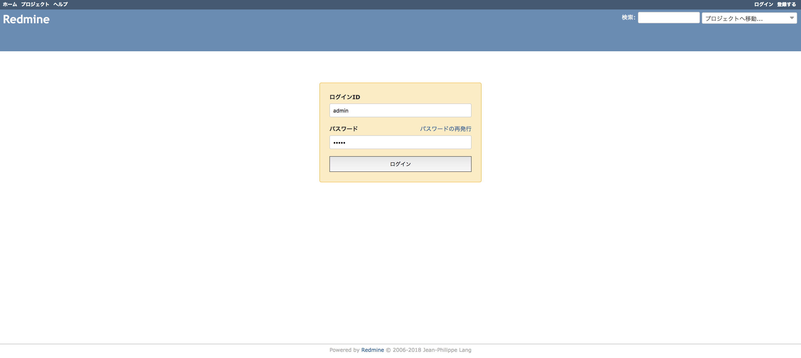

# Redmine

## Minikube

1. VM上にk8sクラスターを作成

    ```
    $ minikube start
    $ minikube dashboard # 起動するとわかりやすい
    ```

2. DB用のStatefulSet, Service, Secret作成

    ```
    $ kubectl apply -f k8s/db
    secret/db-secret created
    service/db-service created
    statefulset.apps/db-statefulset created
    ```

3. Redmine用のDeployment, Service, Secret作成

    ```
    $ kubectl apply -f k8s/redmine
    deployment.apps/redmine-deployment created
    secret/redmine-secret created
    service/redmine-service created
    ```

4. アプリケーションの検査と表示

    ```
    $ kubectl get services
    NAME              TYPE           CLUSTER-IP       EXTERNAL-IP   PORT(S)        AGE
    db-service        ClusterIP      10.108.165.132   <none>        5432/TCP       15m
    kubernetes        ClusterIP      10.96.0.1        <none>        443/TCP        16m
    redmine-service   LoadBalancer   10.108.202.31    <pending>     80:30782/TCP   14m
    ```

5. redmine-serviceのURLを確認する

    ```
    $ minikube service redmine-service --url
    http://192.168.64.12:30782
    ```

6. Redmineのアプリケーションにログインできることを確認する
    * パスワードは Redmine のデフォルトで `admin` です

    

7. クリーンアップ

    ```
    $ kubectl delete deployments --all
    $ kubectl delete statefulsets --all
    $ kubectl delete services --all
    $ kubectl delete secrets --all
    $ kubectl delete persistentVolumeClaims --all
    $ minikube delete # 終了する場合
    ```

---

## GKE

1. GKE上にk8sクラスターを作成

    ```
    $ gcloud container clusters create {CLUSTER_NAME}
    ```

2. DB用のStatefulSet, Service, Secret作成

    ```
    $ kubectl apply -f k8s/db
    secret/db-secret created
    service/db-service created
    statefulset.apps/db-statefulset created
    ```

3. Redmine用のDeployment, Service, Secret作成

    ```
    $ kubectl apply -f k8s/redmine
    deployment.apps/redmine-deployment created
    secret/redmine-secret created
    service/redmine-service created
    ```

4. アプリケーションの検査と表示

    ```
    $ kubectl get services
    NAME              TYPE           CLUSTER-IP      EXTERNAL-IP      PORT(S)        AGE
    db-service        ClusterIP      10.55.248.197   <none>           5432/TCP       5m
    kubernetes        ClusterIP      10.55.240.1     <none>           443/TCP        6m
    redmine-service   LoadBalancer   10.55.253.247   35.194.106.252   80:30190/TCP   5m
    ```

5. `http://{EXTERNAL-IP}` を確認

    

6. クリーンアップ

    ```
    $ kubectl delete services --all
    $ gcloud container clusters delete {CLUSTER_NAME}

    # Persistent Disk が消えてなかったら削除する
    $ gcloud compute disks list
    NAME                                                             ZONE               SIZE_GB  TYPE         STATUS
    gke-sandbox-03a6b1f9-d-pvc-9ab991b7-89c2-11e8-af42-42010a92009f  asia-northeast1-b  10       pd-standard  READY

    $ gcloud compute disks delete {NAME}

    # Target Pool が消えてなかったら削除する
    $ gcloud compute target-pools list
    NAME                              REGION           SESSION_AFFINITY  BACKUP  HEALTH_CHECKS
    a94cad7df8b4a11e88e7d42010a92012  asia-northeast1  NONE                      k8s-b3bfb4ae39736392-node

    $ gcloud compute target-pools delete {NAME}

    # Load Balancer が消えてなかったら削除する
    $ gcloud compute http-health-checks list
    NAME                       HOST  PORT   REQUEST_PATH
    k8s-b3bfb4ae39736392-node        10256  /healthz

    $ gcloud compute http-health-checks delete {NAME}
    ```
